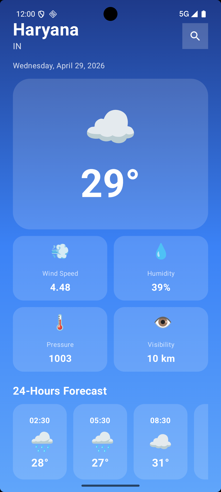
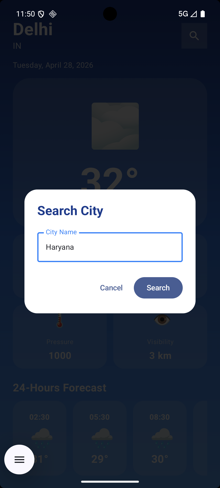
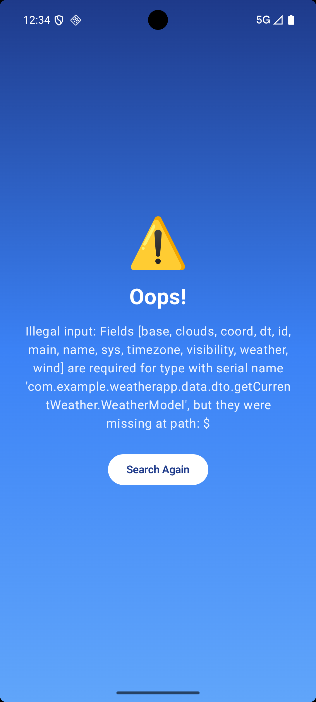

# 🌤️ Weather App

A modern Android weather application built with **Kotlin** and **Jetpack Compose** that provides real-time weather information and forecasts using the OpenWeatherMap API.

---

## 📱 Project Overview

**Weather App** is a feature-rich Android application that displays current weather conditions and 5-day weather forecasts for any city worldwide. The app features a beautiful Material Design 3 UI with smooth animations, comprehensive weather details, and an intuitive search interface.

### Key Highlights:
- ⚡ Real-time weather data from OpenWeatherMap API
- 🎨 Modern Material Design 3 UI with Jetpack Compose
- 📍 Search weather by city name
- 📊 Detailed weather information (temperature, humidity, wind speed, visibility, etc.)
- 🌅 Sunrise and sunset times
- 📈 5-day weather forecast
- 🔄 Pull-to-refresh functionality
- 📱 Responsive design for various screen sizes
- 🌐 Works offline with graceful error handling

---

## 🎯 Features

### 1. **Current Weather Display**
   - Real-time temperature, weather condition, and description
   - Large, readable weather icons and temperature display
   - Current city and timestamp

### 2. **Detailed Weather Information**
   - 🌡️ **Temperature**: Current, feels like, min, and max temperatures
   - 💧 **Humidity**: Current humidity percentage
   - 💨 **Wind**: Wind speed and direction
   - 👁️ **Visibility**: Current visibility distance
   - 🌍 **Pressure**: Atmospheric pressure
   - ☁️ **Cloud Coverage**: Current cloud percentage
   - 🌅 **Sunrise/Sunset**: Times for sunrise and sunset

### 3. **Weather Forecast**
   - 5-day weather forecast with 3-hour intervals
   - Forecast cards showing date, time, temperature, and weather condition
   - Horizontal scrollable forecast list

### 4. **Search Functionality**
   - Search for weather by city name
   - Interactive search dialog with text input
   - Error handling for invalid city names
   - Quick city switching

### 5. **UI States**
   - **Loading State**: Animated loading spinner while fetching data
   - **Success State**: Display complete weather information
   - **Error State**: User-friendly error messages with retry option

---

## 📸 Screenshots

| Home Screen | Search Dialog | Error Screen |
|---|---|---|
|  |  | 

---

## Android Requirements:
- Min SDK: 24 (Android 7.0)
- Target SDK: 36
- Compile SDK: 36
- Java Version: 11

---

## 🔌 API Integration

### OpenWeatherMap API

The app integrates with OpenWeatherMap API to fetch real-time weather data.

**Base URL:**
https://api.openweathermap.org/data/2.5

### 📍 Endpoints Used

#### 1️⃣ Current Weather
GET /weather?q={city}&appid={apiKey}&units=metric

- Returns current weather for specified city  
- Units: **Metric (Celsius)**  

---

#### 2️⃣ 5-Day Forecast
GET /forecast?q={city}&appid={apiKey}&units=metric

- Returns 5-day forecast  
- Data in **3-hour intervals**  
- Maximum **40 data points** per request  

---

### 🔑 API Key
 Enter your Own Api key 

---

 ## 🚀 How to Run

1. Clone the repository
 git clone https://github.com/your-username/weather-app.git

2. Open in Android Studio  

3. Add your API key  

4. Run the app  

---

## ⚠️ Error Handling

- Shows error message on API failure  
- "Search Again" button for retry  
- Handles invalid city input  

---

## 📌 Future Improvements

- 📍 Current location weather  
- 🗓️ 7-day forecast  
- 🌙 Dark mode  
- 🔔 Notifications  

---

## 🤝 Contribution

Feel free to fork this repo and contribute.

---

## 📄 License

This project is licensed under the MIT License.

